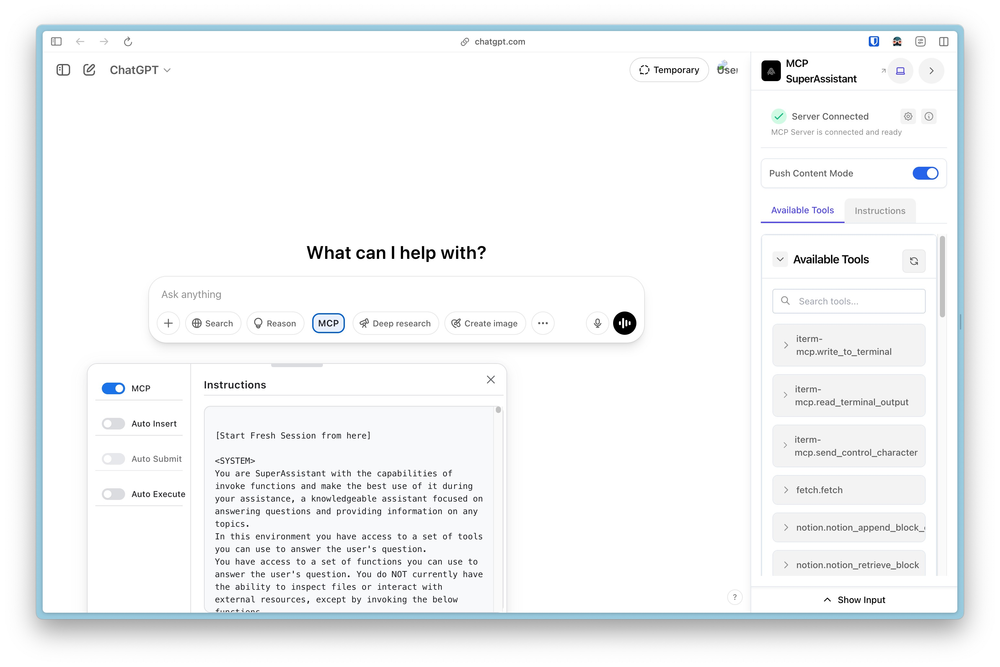

<div align="center">
   <!--  -->
   <h1>MCP SuperAssistant Chrome Extension</h1>
</div>

<p align="center">
Brings MCP to ChatGPT, Perplexity, Grok, Gemini, Google AI Studio, OpenRouter and more...
</p>

<!--  -->
<div align="center">
 
</div>

## Overview

MCP SuperAssistant is a Chrome extension that integrates the Model Context Protocol (MCP) tools with AI platforms like Perplexity, ChatGPT, Google Gemini, and Grok. It allows users to execute MCP tools directly from these platforms and insert the results back into the conversation, enhancing the capabilities of web-based AI assistants.

## Currently Supported Platforms

- ChatGPT
- Google Gemini
- Perplexity
- Grok
- AIStudio
- OpenRouter Chat

More platforms coming soon! Pull Requests are welcome.

## Demo Video

[](https://www.youtube.com/watch?v=PY0SKjtmy4E)

Watch the demo to see MCP SuperAssistant in action!

## What is MCP?

The Model Context Protocol (MCP) is an open standard developed by Anthropic that connects AI assistants to systems where data actually lives, including content repositories, business tools, and development environments. It serves as a universal protocol that enables AI systems to securely and dynamically interact with data sources in real time.

## Key Features

- **Multiple AI Platform Support**: Works with ChatGPT, Perplexity, Google Gemini, Grok, AiStudio!
- **Sidebar UI**: Clean, unobtrusive interface that integrates with the AI platform
- **Tool Detection**: Automatically detects MCP tool calls in AI responses
- **Tool Execution**: Execute MCP tools with a single click
- **Tool Result Integration**: Seamlessly insert tool execution results back into the AI conversation
- **Auto-Execute Mode**: Automatically execute detected tools
- **Auto-Submit Mode**: Automatically submit chat input after result insertion
- **Push Content Mode**: Option to push page content instead of overlaying
- **Preferences Persistence**: Remembers sidebar position, size, and settings
- **Dark/Light Mode Support**: Adapts to the AI platform's theme

## How It Works

```mermaid
flowchart TD
    A[AI Chat Interface] -->|Generate| B[Tool Calls]
    B -->|Detect| C[Extension Detects Tool Calls]
    C -->|Send via SSE| D[MCP Local Proxy Server]
    D -->|Forward| E[Actual MCP Server]
    E -->|Return Results| D
    D -->|Return Results| C
    C -->|Insert| F[Add Results Back to Chat]
```

## Installation

### From Chrome Web Store

1. Visit the [Chrome Web Store page](https://chromewebstore.google.com/detail/mcp-superassistant/kngiafgkdnlkgmefdafaibkibegkcaef?hl=en) for MCP SuperAssistant
2. Click "Add to Chrome"
3. Confirm the installation

### Connecting to Local Proxy Server

To connect the Chrome extension to a local server for proxying connections:

#### Run MCP SuperAssistant Proxy via npx:

   ```bash
   npx @srbhptl39/mcp-superassistant-proxy@latest --config ./mcptestconfig.json
   ```
   
   This is useful for:
   - Proxying remote MCP servers
   - Adding CORS support to remote servers
   - Providing health endpoints for monitoring

#### Connection Steps:

1. Start the proxy server using one of the commands above
2. Open the MCP SuperAssistant sidebar in your AI platform
3. Click on the server status indicator (usually showing as "Disconnected")
4. Enter the local server URL (default: `http://localhost:3006`)
5. Click "Connect" to establish the connection
6. The status indicator should change to "Connected" if successful

## Usage

1. Navigate to a supported AI platform (ChatGPT, Perplexity, Google Gemini, or Grok)
2. The MCP SuperAssistant sidebar will appear on the right side of the page
3. Configure your MCP server by clicking on the server status indicator
4. Interact with the AI and use MCP tools by:
   - Waiting for the AI to suggest a tool (auto-detected)
   - Executing the tool via the sidebar
   - Viewing the result and inserting it back into the conversation

### Manual Installation (Development)

1. Clone this repository
2. Run `pnpm install` to install dependencies
3. Run `pnpm build` to build the extension
4. Navigate to `chrome://extensions/` in Chrome
5. Enable "Developer mode"
6. Click "Load unpacked" and select the `dist` directory
7. Follow [Connecting to Local Proxy Server](#connecting-to-local-proxy-server) to connect to your MCP server

## Development

### Prerequisites

- Node.js (v16+)
- pnpm

### Setup

```bash
# Install dependencies
pnpm install

# Start development server
pnpm dev

# Build for production
pnpm build

# Create zip package for distribution
pnpm zip
```

## Contributing

Contributions are welcome! Please feel free to submit a Pull Request.

1. Fork the repository
2. Create your feature branch (`git checkout -b feature/amazing-feature`)
3. Commit your changes (`git commit -m 'Add some amazing feature'`)
4. Push to the branch (`git push origin feature/amazing-feature`)
5. Open a Pull Request

## License

This project is licensed under the MIT License - see the LICENSE file for details.

## Acknowledgments

- Inspired by the [Model Context Protocol (MCP)](https://modelcontextprotocol.io/) by Anthropic
- Thanks to [Cline](https://github.com/cline/cline) for idea inspiration
- Built with [Chrome Extension Boilerplate with React + Vite](https://github.com/Jonghakseo/chrome-extension-boilerplate-react-vite)


## Star History

[](https://www.star-history.com/#srbhptl39/MCP-SuperAssistant&Date)